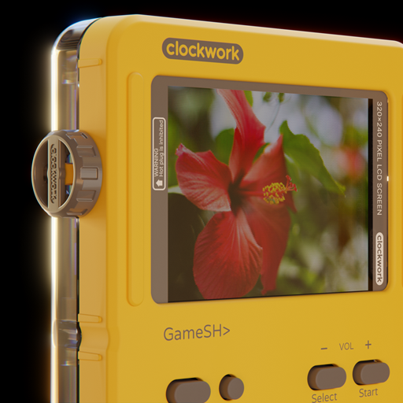
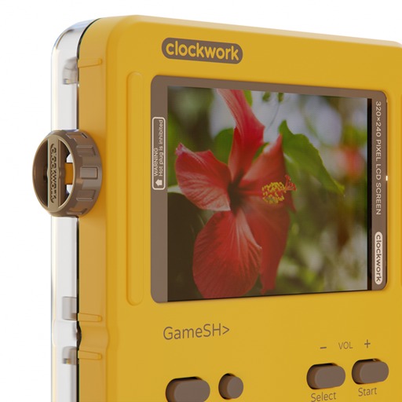
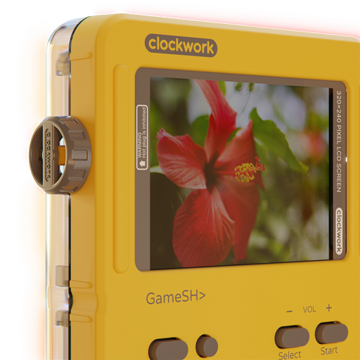

# `realpha`

Recover a usable alpha channel from images that have none!

---

## Huh?

This tool is based on techniques used by Windows screenshot tools of yore.
Back then, Aero was new and people *really* wanted screenshots where title bars were see-through.

My use case is a bit different: To this day, Blender's image exporter will not properly export
images that have certain post processing effects applied to them in the compositor.\
This is my workaround: By exporting two different versions of a render, 
one with a solid black background and one with a solid white background,
this tool will recover a version with an alpha channel that leaves effects intact.

## Installation

There are no prebuilt releases at the moment.
To install realpha, clone this repository, then run `cargo install --path .` inside it.

## Usage

To run realpha on two input images, simply run

```
realpha black.png white.png out.png
```

and it'll generate a new file `out.png` for you.

Images need to be *exactly* the same except for the background, this means their sizes and color modes have to match.

realpha currently supports RGB and grayscale images with 8 and 16 bits per channel.
Output images will be in the same format as input images.
32-bit, paletted, or animated images are not supported and out of scope for this project.

## Examples

<details>
  <summary>Click to view images</summary>

**Input images:**

 

**Output image:**


</details>